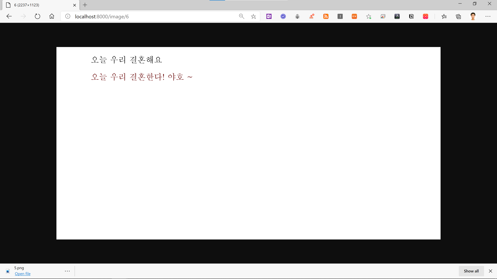

### Text Overlay Image Server 
* Server : Django REST Framework
* Image Processing : Pillow Library 


----

### How to Run

1. Install the requirements (venv 설치 안되어있으면 해야 함)

```
git clone {REPOSITORY_URL}
cd {REPOSITORY_NAME}/imageserver
python -m venv env
source env/Scripts/activate
pip install -r requirements.txt
```

2. Run server (Under the directory where the `manage.py` exists)

```
python manage.py runserver 
```

3. POST /image : 유저가 사진에 올라갈 제목과 내용을 Body 로 전송 (raw text)	

```
{
"title" : "오늘 우리 결혼해요", 
"content" : "오늘 우리 결혼한다! 야호 ~"
}
```

3-1. POST /image 응답 형식 (JSON)

```
{
    "id": 6,
    "title": "오늘 우리 결혼해요",
    "content": "오늘 우리 결혼한다! 야호 ~",
    "createdAt": "2020-07-30T11:51:30.565581Z"
}
```

4. GET /image/<postPk> : 유저가 보낸 /image 의 요청으로 돌아온 id 값을 postPk 에 Path 로 보냄.

```
http://127.0.0.1:8000/image/6
```

4-1. GET /image/<postPk> 에 대한 응답으로 로컬 이미지 파일이 반환됨. (추후에 서버 스토리지에 저장해서 URL 로 반환하기)

